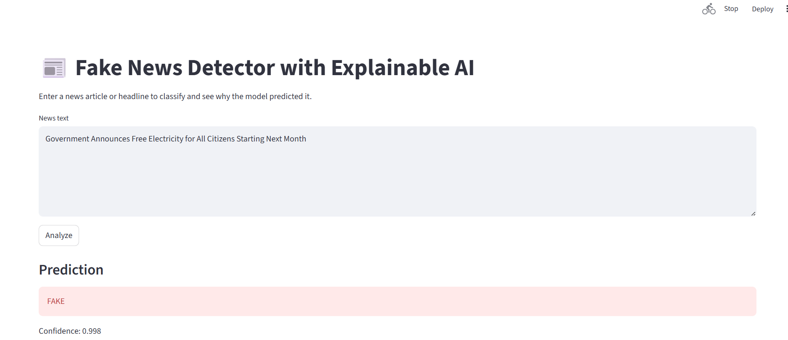
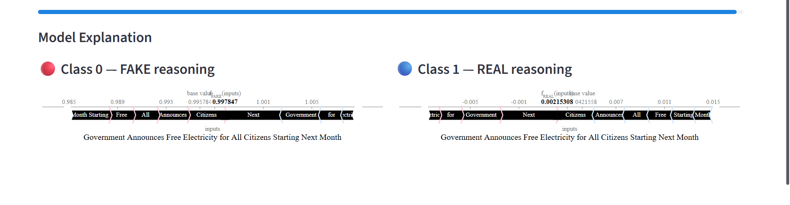

# 📰 Fake News Detection System

A comparative study of classical machine learning, deep learning, and transformer-based models for fake news classification, integrated with Explainable AI and a real-time web interface.

---

## 🚀 Project Overview

This project investigates the effectiveness of different text representation and modeling approaches for fake news detection.  
The study compares:

- TF-IDF + Naive Bayes (Classical ML)
- LSTM
- BiLSTM
- BERT (Transformer)

The system also integrates SHAP-based explainability and a Streamlit web application for real-time inference.

---

## 📊 Model Performance

| Model                     | Accuracy |
|---------------------------|----------|
| TF-IDF + Naive Bayes      | 94.1%    |
| LSTM                      | 99.82%   |
| BiLSTM                    | 99.92%   |
| BERT                      | 99.90%   |

Deep sequential and transformer-based models demonstrated ~6% improvement over classical ML approaches.

---

## 🧠 Explainable AI

- Integrated SHAP to analyze feature/token contributions.
- Compared interpretability across sparse (TF-IDF) and contextual (BERT) representations.
- Studied challenges of explainability in deep transformer architectures.

---

## 🌐 Web Application

- Built using Streamlit
- Real-time text input for prediction
- Displays prediction probability
- Interactive inference interface

Run locally:

bash
pip install -r requirements.txt
streamlit run app.py
🛠 Tech Stack

Python

PyTorch

HuggingFace Transformers

Scikit-learn

SHAP

Streamlit

📂 Project Structure

FAKE_NEWS_DETECTION/
│── app.py
│── detection_phase1.ipynb
│── detection_phase2.ipynb
│── detection_phase3.ipynb
│── clean_data_merged.csv
│── True.csv
│── Fake.csv
│── bert_fake_news_model/

##  📸 Application Screenshots

  

  

